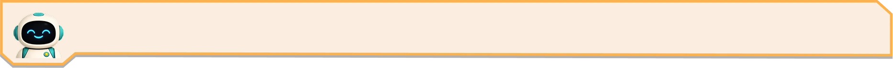

# Bot Show — Project Context

> Single source of truth for the project state. Read this first; you should
> rarely need to open every file. Update this file whenever behaviour,
> structure, coordinates, or assets change.

---

## 1. What this is

A browser **activity game for kids** ("Bot Show"). The player charges a robot's
batteries: pick the low-battery bot, go inside it, and drag battery groups into
slots until current flows and it powers up.

- **Stack:** vanilla **HTML + CSS + JS** only. No framework, no build step, no
  bundler, no npm deps. Just open `index.html`.
- **Must stay responsive** for **mobile, tablet, desktop**.
- Built to match a **Figma** design 1:1.

### Figma source
- File key: `q3XTxsSPlAaNxQJoqde0Gr` (file name "Bot-show"), page "LBD 1" (`30:91`).
- Design frame size: **1920 × 1080** (16:9). All coordinates below are in this space.
- Current screen node ids: **Screen 1 = `160:3467`**, **Screen 2 = `163:3`**
  (the doc has older duplicates `30:*`/`31:*` — ignore those; the `16x:*` set is current).
- Figma is reachable via the Figma MCP connector (design-to-code). The avatar/bot
  art was exported from here.

---

## 2. Folder structure

```
LBD-1/
├── index.html              # single entry; both screens live here
├── context.md              # THIS FILE
├── css/
│   ├── reset.css           # minimal reset; sets Rajdhani as base font
│   ├── main.css            # stage, letterbox, screen system, zoom transition
│   ├── screen.css          # Screen 1 (bots, spotlight, floor, question banner + intro) + shared .question/.question__avatar
│   ├── screen2.css         # Screen 2 (panel, slots, trays, batteries, charge fx, glow, content scaling)
│   ├── screen3.css         # Screen 3 (charged bot celebration)
│   ├── screen4.css         # Screen 4 (concept: 2 parts make a whole)
│   ├── part2.css           # PART TWO screens 5-8 (overcharged/split)
│   └── responsive.css      # breakpoint stubs (mostly empty — see §4)
├── js/
│   ├── navigation.js       # GameNav.show(screenId) — screen switching
│   ├── intro.js            # Screen 1 intro + Screen 2 intro (typewriter, banner open/close)
│   ├── batteries.js        # Screen 2 drag-drop, charge sequence, ghost hint, fully-charged finale
│   ├── concept.js          # Screen 4 (part/whole teaching animation) + auto-start Part 2
│   ├── part2.js            # PART TWO: intro, split puzzle, celebrate, concept (Screens 5-8)
│   └── main.js             # entry: orange-bot click → zoom in; exitBot (zoom out); Esc/#hash helpers
└── assets/
    ├── images/             # see §9
    └── videos/
        ├── bite_talking.mp4      # talking mascot (720×480, 10s) — live avatar in banners
        ├── bite_explaining.mp4   # SOURCE (old): Bite walks in + pulls a rope (green ~#0ED531)
        ├── bite_explaining.webm  # old "your turn" clip — kept but NO LONGER USED
        ├── bite_talking2.mp4     # SOURCE: Bite flies in, superhero landing, talks, wrist tap
        │                         #   (752×480, 10s, GREEN SCREEN #00AA1C). The master.
        ├── bite_talking2.webm    # OLD: transparent VP9 (green removed) — NO LONGER USED
        │                         #   (showed GREEN on iOS/Safari: no VP9-alpha support)
        └── bite_turn.mp4         # USED: full-screen OPAQUE composite — Bite keyed over BG.webp,
                                  #   baked in (1920×1080, H.264). Plays on ALL devices.
```

> ⚠️ **CASE-SENSITIVITY (deploy gotcha):** all asset folders/files are referenced in
> **lowercase** (`assets/videos/…`, `assets/images/…`). Windows is case-insensitive so any
> case works locally, but a Linux deploy server is **case-sensitive** — a `Videos/` vs
> `videos/` mismatch 404s the files and they silently don't load (this exactly broke BOTH
> the question-avatar `.mp4` and the "your turn" `.webm` once: the git folder was tracked as
> `assets/Videos/`). Keep every path lowercase and matching the on-disk/git case. If you add
> a file, verify `git ls-files` shows the case you reference. (Also: some hosts need the
> `video/webm` MIME type configured for `.webm` to play.)

> **⚠️ Transparent video does NOT work cross-device.** The transparent WebM (VP9 + alpha)
> looked right on desktop Chrome but showed a **GREEN SCREEN on iOS/Safari** — iOS has no
> VP9-alpha support, so it ignores the alpha and renders the keyed-out green RGB. (HEVC-with-
> alpha would work on Safari but can't be encoded with ffmpeg on Windows — needs a Mac.)
> **Fix — bake a full-screen OPAQUE composite** (`bite_turn.mp4`): key the green out and
> overlay Bite onto the room bg, so there's no alpha to (not) support. Plays identically on
> mobile / tablet / desktop as ordinary H.264. Recipe (Bite at the same ~72%-width bottom-left
> spot the transparent clip used):
> `ffmpeg -loop 1 -i assets/images/BG.webp -i bite_talking2.mp4 -filter_complex
> "[0:v]scale=1920:1080,setsar=1,fps=30[bg];[1:v]chromakey=0x00AA1C:0.10:0.05,scale=1382:-1[fg];
> [bg][fg]overlay=0:H-h:format=auto:shortest=1[out]" -map "[out]" -an -c:v libx264 -profile:v
> high -pix_fmt yuv420p -crf 20 -preset medium -movflags +faststart -t 10 bite_turn.mp4`
> → 1920×1080, ~1.9MB. `.turn-video` is now full-screen (`inset:0; object-fit:cover`). Sample
> the exact key colour from a corner pixel first (here `#00AA1C`); keep `similarity` tight
> (0.10) so Bite's cyan isn't keyed, and NO `despill` (it greys the blue). NOTE: ffmpeg (like
> sharp) **can't write to `F:` from the sandbox** — write
> to `$TEMP` then `cp` into the project.

**Script load order (in `index.html`, all `defer`):** `navigation.js`, `intro.js`,
`batteries.js`, `main.js`. They communicate via globals: `window.GameNav`,
`window.Batteries`, `window.Screen2Intro`.

---

## 3. The stage & responsive system (`main.css`)

- `.game` fills the viewport; the letterbox fill (bars outside the 16:9 stage) is set
  **per active screen** by `navigation.js` (a `LETTERBOX` map): purple `#0a0130` for the
  Pre-LBD splash, brown `#5a3624` for room screens (1/3/5/7), and a fixed cream
  `#FBE7CB` for interior screens (2/4/6/8) — matching the background outside the panel
  (same for every bot/level) — so the bars blend with each screen's edges.
- `.game__screen` (id `stage`) is a **fixed 16:9 box** sized to the largest that
  fits: `width: min(100vw, 100dvh * 1920/1080)`. It is **not** CSS-scaled — it
  renders at real pixels, so **1 viewport px == 1 stage px** (important for drag math).
- The stage is a **container** (`container-type: size; container-name: stage`),
  so children use **`cqw`** units (1cqw = 1% of stage width = 19.2px at design size)
  for things that must scale — fonts, borders, glows.
- Element positions are **percentages of the 1920×1080 frame** (e.g. left = pxX/1920·100).

**Responsiveness comes for free:** the whole stage scales as one unit; everything
inside is in % / cqw, so mobile/tablet/desktop all work. `responsive.css` has
empty breakpoint stubs for future per-device tweaks (none needed so far).

---

## 4. Screen system & navigation

- Two screens: `<section class="screen screen--1 is-active" id="screen-1">` and
  `<section class="screen screen--2" id="screen-2">`, both inside the stage.
- Only `.is-active` is visible. **Inactive screens stay painted** (`opacity:0`,
  `pointer-events:none`, NOT `visibility:hidden`) so they're already rasterized —
  this was deliberate to avoid a paint stall during the zoom transition.
- `js/navigation.js`: `GameNav.show("screen-1" | "screen-2")` toggles `.is-active`.
- **Deep links:** `index.html#2` (or `#screen-2`) opens Screen 2 directly and plays
  its intro — handy for testing/sharing.
- **Esc** returns to Screen 1 (dev convenience, in `main.js`).

---

## 4b. Pre-LBD — start screen (`screen--pre`, `main.css`)

The **first** screen on load (`is-active`). Full-screen `Pre_LBD.webp` splash
("FIX-A-BOT" title + the two bots + battery) with a big **play button** on the floor:
`.play-btn--icon` (`#play-btn`) is the **`play_btn2.webp` image** (a glossy GOLD rounded
play button with a white ▶ triangle, converted from `assets/images/play_btn2.png` via
sharp → 520×352 webp) — a transparent `<button>` wrapping ``, sized `width:17cqw`,
anchored `bottom:2%` (lowered so it clears the background battery icon), with a `playBob`
bounce + drop-shadow. (Replaced the earlier CSS green circle / the older
`play_btn.webp` orange disc — both unused now.) Clicking it (`main.js`) → `startGame()` →
Part 1 charging tutorial. Because of this,
Screen 1's intro is **on-demand**: its CSS animations are scoped to `.screen--1.is-intro`
and the typewriter runs from `Screen1Intro.play()` (NOT on page load).

**Level transition = theatre curtains.** `#curtains` sits **outside `#stage`** (direct
child of `#game`) and is `position: fixed` so it covers the **whole viewport** including
the letterbox bars. Two velvet curtain halves. `playCurtain(title, sub, onSwap)` (main.js,
the shared helper) closes them over a finished level, runs `onSwap` to swap the screen
behind them, then parts them to reveal the next — matching the auditorium-stage theme.
The per-level transition is **TEXTLESS** (by request — no "Level N Complete" text; uses
`playCurtain("", "", swap, 1500)`); only the **part-complete** ("Part 1 Complete!", →
Part 2 tutorial) and **game-complete** ("All Bots Fixed!") curtains still show a message. (The legacy
`#screen-transition` card is no longer used.)

---

## 5. Screen 1 — choose the bot (`screen.css`)

- **Stage spotlight (animated cue):** Screen 1 first shows ALL bots at normal lighting;
  ~1s after it appears, `Screen1Intro.play()` adds `.is-lit` and the spotlight animates
  on — the beam (`.screen--1 .spotlight`) sweeps onto the centre bot (pivots at the top)
  and the dark radial vignette (`.screen--1::after`) fades in to push the side bots into
  shadow. Both are `opacity:0`/off by default and transition on with `.is-lit`. Replays
  reset `.is-lit` so the cue plays again each entry.
- **Hover** is only on the focal/clickable bot — `.bot--orange:hover` (L1 centre) and
  `.level-2 .bot--purple:hover` (L2 centre). `.bot` is `cursor:default`; only the focal
  bot is `cursor:pointer`. Side bots have no hover/pointer.
- **Levels:** L1 = guided tutorial (fixed 3-bot layout, orange focal). **From L2 = the
  bot chooser** (see below); the old single-bot `.level-2` repositioning rules are now
  superseded (the fixed bots are `display:none` in L2).

### Game structure: TWO halves, each = a guided tutorial then 4 chooser levels
> **MAJOR FLOW (current):** the game is split into two sequential halves so the child
> learns one operation, practises it across all the bots, then learns the inverse and
> practises that. State: **`window.gamePart`** (1 = charge, 2 = split) + **`window.gameStage`**
> (0 = tutorial, 1-4 = the level number within the part).
>
> 1. **Part 1 — CHARGE tutorial** (`gamePart 1, gameStage 0`): the guided 3-bot Screen 1 →
>    charge puzzle (Screen 2) → concept (Screen 4) → dancing bot (Screen 3).
> 2. **Part 1 — CHARGE levels** (`gamePart 1, gameStage 1-4`): the chooser shows the 4 **low**
>    bots; each level the kid charges ONE → it dances → "Level N Complete" curtain → next.
> 3. **Part 2 — SPLIT tutorial** (`gamePart 2, gameStage 0`): after Part 1's 4th level, a
>    "Part 1 Complete!" curtain → Screen 5 overcharged intro → split puzzle (Screen 6) →
>    concept (Screen 8) → dancing bot (Screen 7).
> 4. **Part 2 — SPLIT levels** (`gamePart 2, gameStage 1-4`): the chooser shows the 4
>    **overcharged** bots; each level the kid splits ONE → dances → curtain → next. After
>    the 4th → "All Bots Fixed!" curtain → back to the start screen.
>
> Flow functions in `main.js`: `startGame()` (play button → Part 1 tutorial),
> `startLevels(part)` (enter a part's chooser; resets the chooser), `startPart2Tutorial()`
> (Screen 5), `showYourTurn(part)` (see below). The tutorials hand off via the
> **"your turn" interstitial** (`showYourTurn(part)` in main.js): after the tutorial's
> dancing bot, a **TEXTLESS curtain** closes (`playCurtain("", "", swap, 1500)` — the
> optional 4th arg `openAt` re-opens early for the no-message case), parts on
> `#screen-turn` (`.screen--turn`, the room bg). Earlier text/letters/confetti versions
> were all rejected as bland; the current version uses a **video of Bite (the mascot)**:
> - `#turn-video` = **`assets/videos/bite_turn.mp4`** — a full-screen **OPAQUE** composite
>   (Bite keyed over the room bg, baked in), so it has no alpha to (mis)render and plays on
>   **all devices**. (The earlier transparent `bite_talking2.webm` showed GREEN on iOS — see
>   the video-recipe note above for the why + the compositing command.) `.turn-video` is
>   full-screen (`inset:0; object-fit:cover`); Bite sits at the same ~72%-width bottom-left
>   spot, so the speech-bubble/cue positions are unchanged. Bite **flies in FROM THE LEFT, does a superhero
>   LANDING**, talks, then **taps his wrist**. He's baked at ~72% width, bottom-LEFT (lands at
>   ~36% stage), so he flies in from the left edge and the right side is open room (where the
>   chooser screen then slides in). (The old `bite_explaining.webm` rope-pull clip is kept but
>   unused.)
> - The **speech bubble** `#turn-bubble` ("Now, it's your turn!") pops in (`bubblePop`,
>   rotate/overshoot) at clip ~3.0s (after the landing/stand-up) and hides (`bubbleHide`)
>   ~6.0s, before the wrist tap. It's the **`Speech_bubble.webp`** art (a user-supplied SVG
>   `Speech_bubble.svg`, 1423×604, converted via sharp → 720×306 webp) — a glossy blue
>   bubble with sparkles + a tail — set as the `.turn-bubble` background (`aspect-ratio:
>   1423/604`). Placed **HIGH** at `left:44% top:3%` (well ABOVE Bite — at his head it
>   looked cramped). The **`.turn-bubble__text`** line (bold blue) is **absolutely centred
>   in the bubble BODY** — `left:50% top:43%` + `translate(-50%,-50%)` (43%, not 50%, since
>   the tail occupies the bottom). ANIMATIONS: bubble = `bubblePop` in then idle
>   `bubbleFloat` (gentle bob/tilt loop); text = **typewriter** `turnTypewriter` — a
>   `clip-path: inset(0 100% 0 0)→inset(0)` reveal with `steps(20, end)` (= the 20 chars),
>   left→right, ending centred. (Earlier CSS-drawn bubble + the flex-centred / pulse text
>   were replaced.)
> - Cues are driven by the **clip's own `currentTime`** (`wireTurnTimeline`'s `timeupdate`),
>   NOT wall-clock timers (those fired out of sync). Bite taps his wrist ~6.5s then **TURNS
>   and walks OUT to the LEFT** (gone ~9.5s). The bots start at **`TURN_PULL_AT` (7.6s)** —
>   i.e. as Bite is leaving, NOT at the wrist tap. Handoff (`doFinish`) fires
>   **`TURN_SLIDE_MS`+350 after the pull starts** — once the chooser screen has slid fully in.
> - **CHOOSER ENTRANCE — element-wise merge** (`startBotsPull`): the wrist tap → Bite walks out
>   → the chooser's FOREGROUND elements (the **question banner** + the **bot carousel & its
>   arrows**) slide IN from the right, while the turn screen (room + Bite) stays as the backdrop
>   so the shared room never moves and the two screens "merge". (Evolution: old `#turn-pull` bot-
>   row rig → whole-screen slide → this element-wise slide, per the user.) `startBotsPull` builds
>   the chooser (`setupLevel(2)` + `enterChooser`, still behind), then adds `.screen--1.is-
>   elements-in`, which makes Screen 1 a **transparent overlay** (`background:none; opacity:1;
>   z-index:10`, NOT yet `.is-active`) so the turn screen shows through, and animates `.question`
>   + `.bot-carousel` via `elemSlideIn` (`translateX(125%)→0`). It's **SLOW (3.4s, gentle
>   cubic-bezier(0.25,0.5,0.3,1), carousel staggered +0.25s)** — deliberately, so the elements
>   ease in trailing Bite as he walks OUT to the left and **never overlap/cover him** (he exits
>   left, they enter from the right, he's gone before they reach centre — same pacing the old
>   bots-rig used). A faster slide rushed in over his exit. `#turn-pull`/`#turn-bots`/`fillTurnBots`
>   are now unused.
> - **HANDOFF** (`finalizeTurn`, `TURN_SLIDE_MS` 1.4s+350 after the slide starts): `GameNav.show(
>   "screen-1")` makes it the active screen (deactivates the turn screen), then `is-elements-in`
>   is removed (room bg returns; elements already at x=0 → no jump) and `enterChooser` re-centres.
>   NOT `Screen1Intro.play()` (its banner unroll re-read as a reset).
> - WHY currentTime/ended, not timers: wall-clock cues fired during playback latency and
>   landed out of sync. FALLBACKS in `wireTurnTimeline` use **clip-relative** delays (`7000` /
>   `10600`, NOT `TURN_VIDEO_AT + ...`) so the game can't get stuck if playback never advances.
> - The clip starts at `TURN_VIDEO_AT` (~2200ms, after curtains part); `video.currentTime=0` +
>   `play()` each visit (no `loop`). NOTE: headless snaps CSS transitions to end-state AND
>   `<video>` timing is unreliable, so screenshots show settled states, not the live motion.
> NOTE: under headless virtual-time the `<video>` plays but specific-timepoint
> screenshots desync (a stray frame may show the start screen) — trust the end states.
> Wired in BOTH tutorials: Part 1 `concept.js revealDancingBot` → `showYourTurn(1)`;
> Part 2 `part2.js playConcept2` → `showYourTurn(2)`.
> `currentLevel` is kept as a coarse mode flag (1 = guided tutorial, 2 = chooser/levels);
> `setupLevel(1|2)` toggles it + `.level-2`.

- **The chooser** (`.level-2`, Screen 1): which bots show is decided by `gamePart` —
  **Part 1 shows the low bots, Part 2 shows the overcharged bots**. Each level fixes **ONE**
  bot; every solve advances `gameStage` and completes a level (no more two-phase per level).
- **Low set** (Part 1 LEVELS chooser): **gold** / blue / purple / pink — `<color>_bot[_low].webp`
  (red battery). Fixed → `<color>_bot_charged.webp` (green filled, dances). **`gold` (a yellow bot)
  replaces `orange`** here: orange is the Part-1 **tutorial** bot, so reusing it in the levels read
  as "I already fixed that one." `gold_bot_low/charged.webp` + `panel_gold.webp` are recoloured
  from the **orange** ones via sharp `modulate({hue:32, saturation:1.2, brightness:1.04})` — a
  SMALL hue shift (orange body → yellow) that keeps the orange bot's nice purple→magenta limbs &
  blue eyes, and (being small) keeps the charged bot's green battery green. (First tried teal
  from pink — too close to the blue bot, "two blue bots"; gold/yellow is clearly distinct + kid-
  friendly.) Scheme id is `gold` (avoids colliding with Part-2's `yellow`). The tutorial still
  uses orange (`.bot--orange`, `panel_orange`, `orange_bot_charged`).
- **Overcharged set** (Part 2): a DISTINCT colour set **red / green / teal / yellow** so no
  colour is reused for both states. Recoloured (hue-shift) from the low set's overcharged
  art via sharp (`red←orange -30`, `green←blue -75`, `teal←purple -125`, `yellow←pink +85`);
  their `_bot_charged.webp` (fixed/dancing) and `panel_<color>.webp` are recoloured the same.
  The recolour keeps the **white "!"** but shifts the baked red glow, so a **CSS red chest
  glow** is layered on in the chooser (`.carousel-bot[data-state="overcharged"]::after`,
  screen-blend over the chest, + a red rim glow on the img) so it always reads "overcharged
  red". *(For a perfect baked red glow, swap in Figma-made art — keyed by `data-scheme`.)*
  **Overheated marks:** each overcharged carousel bot shows a small fan of cyan **steam
  squiggle marks** hugging the top of its head — matching the Screen-5 white bot's BAKED look.
  A `.heat-steam` span (5 short wavy `<i>`, SVG data-uri, `#84c8cf`) is injected by
  `carousel.js` `init()` into every `[data-state="overcharged"]` button, styled in screen.css
  (`bottom:74%` of the button = right above the head; `height:13%`, marks fanned via per-child
  `--r` tilt ±12°/±6°/0 and varied heights). **Per-bot `bottom` overrides** because each image
  bakes a different head height/top-padding: red 74% (base), green 64%, teal 78.5%, yellow 78.5%
  (`.carousel-bot[data-scheme="…"] .heat-steam`). These were **derived from each webp's alpha
  bounding box** (content-top ÷ height → head-top as a % of the bottom-aligned button: red 74.1 /
  green 64.0 / teal 78.7 / yellow 78.4 — yellow's geometry is ~identical to teal, both tall
  images, so they share ~78.5%; an earlier eyeballed yellow=71% was wrong). They are **static** — NOT a rising/emitting steam;
  the only motion is a faint in-place `heatShimmer` (opacity 0.7↔1 + 6% bob). Scales with the
  coverflow `transform` (it's a button child). Hidden on `.is-fixed`. (The Screen-5 white bot
  keeps its baked-in version.)
  **Grounding:** the 4 `_bot_overcharged.webp` (and `blue_bot_low/charged`,
  `green_bot_charged`) had large transparent BOTTOM padding baked in (green was 16.5% of
  its height!), which made them float above the floor in the bottom-aligned carousel —
  they were cropped (sharp `extract`) to ~1.5% bottom pad so the feet sit on the shadow.
  If new bot art is added, **trim its bottom transparent padding** the same way.
  KNOWN ARTIFACT: the recoloured `_bot_charged.webp` chest battery is hue-shifted too,
  so it isn't green on red/green/teal/yellow — replace with Figma art to fix properly.
- `data-scheme` (colour) + `data-state` (low|overcharged) on each `.carousel-bot`. CSS shows
  **only one state per part**: `.bot-carousel:not(.phase-split)` hides all `overcharged`,
  `.bot-carousel.phase-split` hides all `low` (so Part 1's charged-and-dancing low bots don't
  leak into Part 2). `enterChooser` sets `phase` from `gamePart` each entry. (The old
  per-level two-phase `chargedColor`/`.is-locked` exclusion was **removed**.)
  - **Scroll hint: REMOVED.** The row used to auto-pan left→right→centre on the first level of
    each part (`scrollHint()`); now that prev/next **arrow buttons** make browsing obvious, the
    auto-pan was removed (and its `hintShown`/`hintRunning` state). `tweenScroll`/`.no-snap`
    remain — `nudge()` (the arrows) still uses them.
  - **Banner per part** (`enterChooser`, via `Screen1Intro.setText`, a cancellable typer):
    Part 1 = "Scroll and tap a bot to charge it.", Part 2 = "Oh no! These bots are
    overcharged — tap one to fix it." (`intro.js` no longer auto-types `data-text2` in
    chooser mode, which used to clobber this.)
  - **Open/close banner (screens 2/3/4/5/6/8):** the **open** art is `Question_template.webp`
    (`.question__template`), which **rolls** open/shut via `clip-path` — closed = `inset(0 91% 0 0)`
    (rolled to the badge), open = `inset(0 0 0 0)`, `transition: clip-path 0.5s cubic-bezier(0.2,0.8,0.2,1)`
    (the per-screen `.screen--N .question__template` / `.is-open` rules). The **closed** art is a
    dedicated badge image **`Question_template_close.webp`** (a self-contained orange-bordered
    octagon + bot, from `Question_template_close.svg`) shown via `.screen--N .question::before`
    (`z-index:1`, opacity 1 closed → 0 when `.is-open`, fade 0.45s) **on top of** the rolling
    template's cap, so the closing reads as the body retracting INTO the badge (not a flat
    crossfade). The closed clip is **`inset(0 100% 0 0)`** (template fully rolled away) — the
    badge is an octagon whose chamfered top/bottom corners narrow inward, so any partial clip
    (e.g. 9%) left a vertical sliver of the open template poking past those corners; rolling
    the template fully shut and letting the badge image be the entire closed visual removes it. The talking-video
    avatar (`.question__avatar`, `z-index:2`) sits on top of the badge in both states. Screen 1's
    banner is always-open (uses `templateUnroll` + `.is-intro`) and is excluded.

### Chooser carousel (`carousel.js`, `index.html`, `screen.css`)
Horizontal **scrollable row** (`.bot-carousel__track`, only under `.level-2`), staged like
Screen 1 via coverflow: `carousel.js layout()` scales each bot by distance from centre
(centre big & front, sides small & set back), and each `.carousel-bot::before` is its floor
shadow. CSS shows only the current part's bots (`.phase-split` = Part 2 overcharged, else
Part 1 low — see §5); fixed bots of the current state keep dancing.
- **Flow:** tap a bot → `select()` centres it, **spotlight falls** (`.is-choosing` dims the
  rest + `.is-lit`), then `chooseBotEnter(scheme, part)` (main.js) sets `panel_<scheme>` and
  zooms in (`enterBotTo`) → charge (`screen-2`, part "1") or split (`screen-6`, part "2"),
  where `part` = `phase === "charge" ? "1" : "2"`.
  - ⚠️ BUG FIX: `enterBotTo` reveals the puzzle screen at ~380ms but its setup used to run
    only on settle (~1200ms), so the PREVIOUS level's filled/charged board flashed for
    ~0.8s. `chooseBotEnter` now resets the board **immediately, before the zoom** —
    `Batteries.setup()` (charge) / `Part2.resetSplit()` (split, extracted from `startSplit`)
    — so each level starts visibly empty. (Full setup still re-runs on settle; harmless.)
- **After a puzzle**, `returnToChooser()` (main.js) → `BotChooser.onFixed(scheme)`: marks
  that bot fixed (swaps to charged art + dances) and **advances `gameStage`** — each solve
  completes a level. Then: if `gameStage <= 4` → **TEXTLESS** `playCurtain("", "", …, 1500)`
  → `enterChooser(false)` for the next level; if `gameStage > 4` → the part is done →
  `gamePart 1`: `playCurtain("Part 1 Complete!", …)` → `startPart2Tutorial()`; `gamePart 2`:
  `playCurtain("All Bots Fixed!", …)` → start screen.
- **Prev / Next arrow buttons** (`#carousel-prev` / `#carousel-next`, inside `.bot-carousel`
  so they only show in chooser mode): for **desktop play / kids who don't scroll**. Gold
  button art `next_button.webp` (from `next_button.png`, left chevron); `--next` is mirrored
  (`scaleX(-1)`) to point right. `carousel.js nudge(dir)` finds the bot nearest centre and
  `tweenScroll`s to centre its neighbour (snap off during the tween). Hidden during a
  selection (`.screen--1.is-choosing .carousel-nav`) AND while the chooser elements slide in
  (`.screen--1.is-elements-in .carousel-nav`) — so the arrows only **fade in once all the bots
  have arrived** on screen (opacity transition; revealed when `is-elements-in` is removed in
  `finalizeTurn`).
- **`startLevels(part)`** calls `BotChooser.reset()` so each part begins with all of its
  bots fresh (un-fixed, original art).
- Counts per puzzle come from `window.STAGES[gameStage]` via `getCounts(1|2)` (see §8).
- `intro.js Screen1Intro.play()` is chooser-aware: in chooser mode (`currentLevel === 2`) it
  skips the auto-spotlight and calls `BotChooser.enterChooser()`, which OWNS the banner text.
- Test via the dev menu → "Part 1: Charge levels" / "Part 2: Split levels".
- Each bot's low-battery symbol is **baked into its art** (e.g. `orange_bot.webp` has the
  low-battery chest icon in the image). (An earlier `.chest-low` CSS overlay was removed
  once the bot art included the icon directly.)


Background = `BG.webp`. Contents:
- **Spotlight** `spotlight.svg` — full-height beam centered on the orange bot, z1.
- **Floor shadows + warm glow** — CSS radial-gradient `div`s (`.floor*`), recreated
  from Figma ellipses (those were blurred PNGs, not exported). z2/3.
- **Three bots** (`.bot`, sized by `width` %, positioned by Figma coords):
  - `.bot--purple` `purple_bot_low.webp` (low-battery purple) — left, tallest, back.
    Dimmed `filter: brightness(0.8)` so it recedes like the right bot; reset to full
    brightness when it becomes the L2 focal bot (`.level-2 .bot--purple`).
  - `.bot--orange` `orange_bot.webp` — center, focal, z6, **clickable** → Screen 2.
  - `.bot--white-blue` `White_blue_bot.webp` — right, smallest, back.
  - Subtle `:hover` scale. `decoding="async"` was REMOVED from bots (it caused a
    headless paint race / intermittent missing bot).
- **Question banner** `.question` (see §7) with text **"Tap the bot to fix its batteries."**

---

## 6. Zoom-into-bot transition (`main.css` + `main.js`)

Clicking the orange bot (`enterBot()` in `main.js`) plays a smooth dive into the
bot's **chest battery icon** then Screen 2 emerges. Key facts (tuned for smoothness):
- `transform-origin: 49.6% 73%` on `.screen--1.is-zooming` = the chest battery icon.
- Screen 1 zooms `scale(1)→scale(4.2)` + fades, easing `cubic-bezier(0.42,0,1,1)`,
  0.75s. **Scale capped at 4.2** (higher, e.g. 11×, blew the GPU texture limit and
  caused a re-raster hitch — do not raise much).
- Screen 2 (`.is-entering`) enters `scale(2)→scale(1)` + fades, same transform-origin,
  0.72s, decelerate easing.
- **Handoff at ~380ms** (`main.js` setTimeout): Screen 1 reaches ~2× exactly when
  Screen 2 starts at 2× → seamless, scale-matched crossfade (no jump).
- Only `transform`/`opacity` animate (compositor-friendly). No blur (blur re-rasters).
- At ~1200ms: cleanup + `Screen2Intro.play()` is called.

---

## 7. Question banner (shared) + the live mascot video

Used on **both** screens (any template with dialogue). Markup:
```html
<div class="question" [id="question-2" on screen 2]>
  
  <video class="question__avatar" src="assets/videos/bite_talking.mp4" muted loop autoplay playsinline></video>
  <p class="question__text" data-text="...the line..."></p>
</div>
```
- `Question_template.webp` = the **open** cream banner art (mascot cap baked in at the
  left). `Question_template_close.webp` = the **closed** art (a self-contained octagon
  badge, from `Question_template_close.svg`). Positioned by Figma coords (left 1.458%,
  top 4.167%, width 97.135%). Open/close = an opacity **crossfade** between the two (see
  §"Open/close banner" above) — NOT clip-path.
- **`.question__avatar`** (in `screen.css`) overlays the **`bite_talking.mp4`** video
  on the badge face (muted, looping) → the mascot looks alive and talks, in both the
  open cap and the closed badge. Same for all dialogue templates.
- **`.question__text`**: Rajdhani **Bold**, color `#4f2b0f`, `font-size: 2.344cqw`
  (= 45px at design), positioned over the cream bar. Text is stored in `data-text`
  and starts empty (no flash); JS types it in.

### Open/close animation
- **Screen 1** (`screen.css`, scoped to `.screen--1`): on load the banner pops in
  showing **only the mascot** (clip-path), then **unrolls open** (`templateUnroll`),
  then `intro.js` **typewrites** the text (45ms/char) — triggered on the template's
  `animationend`.
- **Screen 2**: class-driven, controlled by `intro.js` `playScreen2Intro()`:
  - `.screen--2 .question__template` is clipped closed (mascot only) by default;
    adding `.is-open` transitions clip-path to fully open (and removing it closes).
  - Sequence: open → type **"Drag the batteries in a small slots."** → **brief hold
    `HOLD_AFTER_TEXT = 600`ms** → close to just the mascot → ghost hint (non-blocking;
    dragging is already enabled). Kept short so the player can drag almost immediately.
  - **VO TODO:** replace the 600ms hold with the audio's `ended` event when VO exists.

---

## 8. Screen 2 — inside the bot (`screen2.css` + `batteries.js`)

Background = dark radial gradient. Structure:
```
#screen-2
├── .s2-content (#s2-content)        # gameplay layer; scaled during the banner intro
│   ├── img.panel (battery_slots.svg)            # full circuit-board panel: border+slots+connectors
│   ├── img.slot-glow.slot-glow--big (Bigger_Slot.svg)  # green charged-glow overlay (hidden until charged)
│   ├── .slot.slot--big / --small-left / --small-right  # invisible drop-zones
│   ├── svg.charge-fx (#charge-fx)               # current-flow overlay (see charge seq)
│   ├── .tray.tray--blue / .tray--yellow         # CSS-built trays (nested rounded rects + accent + decorator tabs)
│   └── (battery groups injected here by JS)
└── .question (#question-2)          # banner (NOT scaled) — see §7
```

### Panel & slots
- **Per-bot colour scheme (from Figma `287:719`):** each bot's interior board is a
  **filled colour** matching the bot. The board is a pre-rendered image
  `panel_<scheme>.webp` (1920×822, exported from the Figma "Main container" frames and
  stretched to the exact battery_slots canvas so slots line up). Schemes:
  **orange** = Part 1 L1, **purple** = Part 1 L2, **white** = Part 2 L1,
  **blue** = Part 2 L2 (the Part-2 bot is hue-blue in L2). `panel_pink.webp` is also
  exported (pink bot) but no current screen uses it.
  - `main.js setPanelScheme(screenIds, scheme)` swaps the `src` of every `img.panel`
    layer; called from `setupLevel()` → screens 2/4 get orange|purple, screens 6/8 get
    white|blue. All 4 panel layers (`.panel`, `.panel--small-left/right`, `.panel--big`)
    share the one scheme image.
  - **Background OUTSIDE the panel** is a fixed cream **`#FBE7CB`** on every interior
    screen (`.screen--2/4/6/8`) and the **letterbox** bars (`navigation.js LETTERBOX`) —
    the same for every bot/level (NOT tinted per bot).
  - **Board (INSIDE the panel)** keeps each bot's colour. The orange board was recoloured
    to **`#F5C99A`** (a soft peach) — `panel_orange.webp` was re-tinted with sharp
    (`modulate brightness 1.22 / saturation 0.55 / hue +5`) from the brighter Figma
    orange. The other boards stay their Figma colours.
  - **No more hue-rotate/grayscale board recolouring.** The board keeps its bot colour;
    charge **success** is signalled by the green **slot-glow** + green **current flow**
    (not the board), and Part 2 **overcharge** by the red/yellow/green **slot-glow** on
    the big slot. (The old `battery_slots.webp` / `battery_slots_white.webp` are now
    unused.)
- (Legacy) `battery_slots.svg` (true vector, ~280KB) is the **whole panel** (1834×786) at
  Figma (43,40): the metallic border, the 3 slots, the orange connectors, decorators.
- Trays are **recreated in CSS** (the tray SVGs had the batteries baked in, so they
  couldn't be emptied). Blue accent `#96f2f7`, yellow accent `#f3e21f`, grey rim `#5f5e5e`.
- **Slot inner rects (design px), used for layout + drop centers** — small slots were
  re-centred to the new filled panels (batteries were sitting low/bottom before):
  - big: `{x:715, y:143, w:501, h:250}` (centre 965,268)
  - small-left: `{x:425.5, y:552.5, w:407, h:139}` (centre **629, 622**)
  - small-right: `{x:1098.5, y:551.5, w:407, h:139}` (centre **1302, 621**)
  - (Same centres mirrored in `part2.js SLOTS`, `concept.js LAYOUT`, `part2.js C_LAYOUT`.)

### Per-stage battery counts (`main.js window.STAGES` / `getCounts(part)`)
The "whole" splits into two parts — **blue** group + **yellow** group. Counts vary by
stage (Tutorial + Levels 1-4) per the design table:

| Stage | Part 1 (charge) blue,yellow | Part 2 (split) blue,yellow |
|---|---|---|
| Tutorial | 4, 2 | 3, 2 |
| Level 1 | 3, 5 | 4, 3 |
| Level 2 | 6, 3 | 7, 3 |
| Level 3 | 6, 4 | 5, 4 |
| Level 4 | 6, 6 | 6, 5 |

`window.gameStage` indexes `STAGES`; `getCounts(1|2)` returns `{blue,yellow}`. Wired into
`batteries.js setupBatteries` (Part 1), `part2.js startSplit` (Part 2) and `concept.js`.
`setupLevel(2)` starts a part's chooser at `gameStage 1`; the chooser then advances
`gameStage` 1→4 as each level is completed (each level = ONE bot). **Fit-to-slot scale:**
groups placed in a SMALL slot use `window.batteryFitScale(count)` (defined in
`batteries.js`, used by `part2.js` + `concept.js`) = `min(PLACED_SCALE, 407·0.96 /
groupWidth(count))` — so a 7-battery group (506px native, 415px at 0.82 > the 407px slot,
which used to overflow) shrinks to ~0.77 and always fits. Big-slot placement stays at
`PLACED_SCALE` (the 501px big slot fits the widest group). The chooser banner is set per
part by `enterChooser` (`Screen1Intro.setText`, a cancellable typer): Part 1 "Scroll and
tap a bot to charge it.", Part 2 "Oh no! These bots are overcharged — tap one to fix it."

### Batteries & drag-drop (`batteries.js`)
- Two **groups** (single draggable units, NOT individual batteries); counts come from
  `getCounts()` above (defaults blue 4 / yellow 6):
  - blue tray center `(506.5, 948.5)`
  - yellow tray center `(1413.5, 948.5)`
  - battery art = `blue_battery.png` / `yellow_battery.png` (62×100, transparent,
    exported isolated from Figma with `contentsOnly`). Single battery = `3.229cqw` wide.
- A group is positioned by its **center** (`left/top` %, `translate(-50%,-50%)`).
- **`PLACED_SCALE = 0.82`** — uniform battery size in **every** slot (sized so the
  6-yellow group fits the smallest slot; never overflows). Tray = scale 1.
- **Only the two bottom slots** (`small-left`, `small-right`) accept drops. The big
  (top) slot is the auto-charge destination, not a manual target.
- Drag = Pointer Events (mouse + touch). While dragging, full size; drop on a slot →
  snaps to slot center at `PLACED_SCALE`; drop elsewhere → animates home. Slot under
  pointer highlights (`.slot.is-hover`).
- **Big-slot rejection (Part 1):** the big slot is NOT a drop target — dropping a group
  on it calls `rejectBig()` (batteries.js): the group bounces home (the group's normal
  left/top transition) and the big slot **flashes red + shakes "no"** — the
  `.slot-glow--big` overlay swaps to `Bigger_Slot_Red.svg`, gets `.is-rejected`
  (opacity 1, red drop-shadows, `slotReject` translateX shake, screen2.css), then
  restores to `Bigger_Slot.svg` after 550ms. Cleared by `clearReject()` on charge
  start + setup. (Part 2 has no such case — there the big slot IS the groups' home.)
- Dragging is **gated** by `enabled` (Battery API). It's OFF during the Screen 2
  intro and ghost hint, then turned ON.

### Charge sequence (when BOTH bottom slots filled)
`startCharge()`:
1. Current flows up through the connectors — `#charge-fx` SVG overlay, paths trace
   the **exact connector centerlines**:
   - **Re-calibrated to the new filled panels** (the connectors/slots shifted ~10-15px
     vs the old `battery_slots` art): left `M660,540 L748,420`, right `M1260,540 L1172,420`,
     horizontal glow `M850,628 L1070,628`. (The concept's small-slot glows in `screen4.css`
     were likewise nudged to the new slot positions: `top ~50.5%`, `width 21.72%`.)
   - bright pulses travel (dash animation) on the **two diagonals only** (bottom→top);
     the horizontal left→right connector is intentionally NOT flow-animated — it's
     omitted from the `.charge-flow` group (kept in `.charge-glow` for the green end-glow).
2. (+500ms) both groups travel **up into the big slot** as two rows (blue top y217,
   yellow bottom y319, center x965.5), uniform `PLACED_SCALE`.
3. (+1400ms) `#charge-fx` turns **green** (`.is-green` → `.charge-glow` paths) and the
   **big slot glows green**.
- **Big-slot green glow**: NOT a box-shadow. It's `.slot-glow--big` = a
  **`Bigger_Slot.svg`** overlay sitting exactly on the big slot, with a green
  **`drop-shadow`** so the glow **hugs the slot's real rounded shape + tabs**.
  It pulses by fading the overlay's opacity (`slotGlowPulse`) while the orange slot
  underneath stays put. (This replaced an earlier boxy box-shadow that looked bad.)
- After charging, dragging is locked (`charged = true`).

### "Fully charged" finale (`fullyCharged()` in `batteries.js`, ~3.6s after charge starts)
Once the batteries are in the big slot and it's glowing green, the finale plays
(all animated, sequenced):
1. **Battery trays + their placeholder ghosts fade out** (`.tray`, `.tray-ghost`),
   then are `display:none`'d so nothing lingers.
2. **The board slides down** to fill the now-empty bottom — `.s2-content.is-charged-final`
   = `transform: translateY(14%)` — **EXACTLY matching `.s4-content`'s 14%**: it was 15%
   and the 1% mismatch showed as a vertical jitter when Screen 4 swapped in.
3. **NO banner message here** (by request). "The bot is fully charged." moved to
   **Screen 3** — `#question-3` (banner added to screen-3, closed-clip CSS in
   screen3.css) opens + types via `Screen3Intro.showMessage()` (intro.js), called from
   BOTH Screen 3 entries: `exitBot()` (main.js) and `revealDancingBot()` (concept.js).
   It fires **AFTER the reveal settles (~1300ms)**, not at screen-show — otherwise the
   unroll finishes during the zoom-out and is never seen. The dance windows give it
   room: tutorial `onDanced` after 3800ms; levels `returnToChooser` after 5100ms.
4. **~1.6s after the finale starts** (shortened — no message hold),
   it transitions onward: tutorial → Screen 4 concept; levels → **Screen 3** via `GameFx.exitBot()`
   — the **reverse** of the enter-zoom: we pull back OUT of the chest (same 49.6%/73%
   focal point), the interior recedes, and the whole charged bot is revealed shrinking
   from a chest close-up to normal size (`zoomOutOfBot` + `revealBot` in `main.css`).
> NOTE: the codebase has user edits around the charge sequence — e.g. the panel
> turns green via `.panel.is-green { filter: hue-rotate(110deg) }`, batteries do a
> FLIP-style travel into the big slot with low-opacity ghost trails, and there are
> `.panel--small-left/right/big` clip overlays. The `.tray-ghost` class on the
> permanent 20%-opacity tray placeholders is what the finale fades out.

### Screen 2 intro flow (the full on-enter sequence)
zoom inside → `.s2-content.is-compact` (content shrinks **and shifts down** so the
banner has a clear gap above the panel: `transform: translateY(10%) scale(0.85)`) →
banner opens + types prompt → holds 3.5s → banner closes to mascot + content grows
back to normal (smooth) → **ghost hint** demonstrates the drag **3×** (a translucent
blue group glides tray→small-left slot, `.is-ghost`) → dragging enabled.

### Ghost hint + inactivity nudge (both puzzles)
Both puzzles share the same ghost-demo pattern (`ghostRun(cycles)` in `batteries.js`
AND mirrored in `part2.js`): a translucent `.is-ghost` copy of a **still-undropped
group** glides into the **first empty slot** (source/target picked fresh each cycle,
so the demo always shows a legal move). Part 1 = tray → small slot; Part 2 = big slot
→ small slot. The glide kick uses `setTimeout(30)` NOT rAF (headless-virtual-time
lesson). Two uses:
- **Tutorial demo:** `ghostRun(3)` plays automatically once dragging unlocks (Part 1
  after the banner closes via `playHint()`; Part 2 in `startSplit`'s banner callback).
  Tutorial only. A stray mouse move does NOT cancel it — only starting a real drag does.
- **Inactivity nudge (levels only):** in chooser levels there's no upfront demo, but
  if the kid does nothing for **`IDLE_MS = 12000`** (12s), `ghostRun(Infinity)` loops
  the demo **until any pointer activity** (pointerdown/pointermove listeners on the
  screen, `onActivity` → `abortHint()` + re-arm the 12s clock). Cleared on charge/fix/
  setup/leave (`cancelIdle()`).

> **Chooser levels (`currentLevel === 2`) = play solo.** Only the **tutorials**
> (`currentLevel === 1`, the guided flow) show the ghost hint + the concept screens.
> In the chooser levels the ghost hint and concepts are skipped, but the **full-screen
> dance always plays**: Part 1 (`batteries.js`) charge finale → sets the Screen 3
> `.charged-bot img` to `<scheme>_bot_charged.webp` → `GameFx.exitBot()` (zoom-out
> reveal) → dances ~3s → `returnToChooser()`; Part 2 (`part2.js onFixed`) split → sets
> the Screen 7 bot the same way → `zoomOutTo("screen-6","screen-7")` → ~3s →
> `returnToChooser()`. So every fixed bot celebrates full-screen before the
> level-complete curtain. (The tutorial dance bots: Screen 3 via `setupLevel`,
> Screen 7 = `White_purple_bot_charged.webp`, restored in `onFixed`'s tutorial branch.)

---

## 8b. Screen 3 — the bot celebrates (`screen3.css`)

The celebration screen. Same room background as Screen 1
(`var(--bg-image)` = BG.webp) + the `spotlight`, with the **charged bot centered**:
`.charged-bot` wraps `orange_bot_charged.webp` (placeholder — **swap for a dancing
video later**). It does a gentle CSS "dance" loop (`botDance`: bob + sway, pivot at
feet) while `.screen--3.is-active`. Markup is a `<section class="screen screen--3"
id="screen-3">` inside the stage.

**Order:** the dance comes **AFTER the concept** (Screen 4), not before. The
concept screen zooms OUT of the board to reveal the dancing bot
(`concept.js revealDancingBot()` → `.screen--4.is-zooming-out` + `.screen--3.is-revealing`,
reusing the `zoomOutOfBot`/`revealBot` keyframes). It dances ~3s, then — in the **new flow**
— `concept.js` calls **`startLevels(1)`** to begin the Part 1 charge levels (NOT Part 2).

---

## 8c. Screen 4 — concept "2 parts make a whole" (`screen4.css` + `concept.js`)

Reached straight from Screen 2's finale (`batteries.js`, ~3.2s after charging —
**stays inside the bot**, no dance yet). After the concept teaches, it zooms out
to reveal the dancing bot (Screen 3), which then leads into Part 2.
Uses the **charged (green) panel** look from Screen 2's end state — same layered
panel imgs (`panel is-green` + `panel--small-left/right` orange overlays +
`panel--big is-green`) — and `.s4-content { transform: translateY(14%) }` nudges the
board down so the whole panel clears the banner and is fully visible.
Dark interior bg + batteries in all three slots:
- **small-left** = 4 blue (part 1), **small-right** = 6 yellow (part 2),
- **big** = 4 blue (top row) + 6 yellow (bottom row) = the whole.
`concept.js` builds the battery groups (display-only, `SCALE 0.82`) and plays a
two-phase animation synced to the banner prompt **"These 2 parts make this whole."**:
- **Phase A ("These 2 parts")**: starts as the prompt begins typing; the big-slot
  batteries dim to 20% (`.battery.is-dim`); the two **part SLOTS glow one by one**
  (`.slot-glow--small-left` then `--small-right`, `SLOT_GLOW_STAGGER` apart;
  Smaller_Slot.svg overlays). The batteries themselves do NOT glow.
- **Phase B ("make this whole.")**: the part-slot glows turn off + their batteries dim;
  the big-slot batteries go full opacity and the big slot glows green
  (`.slot-glow--big.is-charged`).
Phase timings are **placeholders for the VO** (`SLOT_GLOW_STAGGER`, `PHASE_GAP` in concept.js).
`.screen--4 .battery.is-dim` is scoped so Screen 2 is unaffected. Deep-link: `index.html#4`.

---

## 8d. PART TWO — fixing overcharged bots (`part2.css` + `part2.js`)

The inverse of Part One: bots are **overcharged** (the whole is too full), and the
child **splits** the whole into two parts. In the **new flow**, Part 2 starts after **all 4
Part 1 charge levels** are done: `returnToChooser()` (`gamePart 1, gameStage > 4`) →
"Part 1 Complete!" curtain → **`startPart2Tutorial()`** → `GameNav.show("screen-5")` +
`Part2.startIntro()`. (Screens 5-8 are the Part 2 **tutorial**; the Part 2 **levels** then
reuse the chooser with the overcharged bots.)

Screens (continue the `screen--N` numbering; deep-links `#5`–`#8`):
- **Screen 5** (`screen--5`, intro): room bg + 3 bots in a `.s5-stage` wrapper
  (left `purple_bot.webp`, centre overcharged `White_purple_bot.webp`, right
  `orange_bot_charged.webp`). Three-phase choreography (in `Part2.startIntro`):
  **A** all bots equally lit (spotlight hidden) — "Oh no! A few bots have overcharged.";
  **B** spotlight fades in on centre + sides darken (`.screen--5.is-spotlit`) — "Let's
  start fixing this bot."; **C** side bots fade out (`.is-gone`) + the scene zooms in a
  little (`.s5-stage.is-focusing` scale 1.4, origin 50.7%/70%) — "Let us split its
  batteries." Tapping the centre bot (`enterFromFocus`) continues that zoom into Screen 6.
  The banner (sibling of `.s5-stage`) is NOT scaled by the little zoom.
  - The **spotlight sweeps** onto the centre bot like a real stage light: it pivots at
    its top (`transform-origin:50% 0`) from `rotate(-20deg)` → `0`, fading in fast so the
    movement reads.
  - The purple (left) bot's "!" overcharge mark is baked into `purple_bot.webp`
    (528×621 source). The center bot's mark is likewise part of `White_purple_bot.webp`.
- **Screen 6** (`screen--6`, split puzzle): the **big slot starts FULL** (blue row +
  yellow row, green `panel--big is-green`); small slots empty. Banner prompts "Drag the
  batteries to the small slots." then closes; the player drags each group **big → small**.
  When **both small slots are filled**, `onFixed()` shows "This bot is fixed." then
  goes **straight to the concept** (Screen 8) — stays inside the bot. (Same drag
  pattern as Part 1, reversed direction.)
- **Screen 8** (`screen--8`, concept): "This whole is made of these 2 parts." — the
  **inverse** of Screen 4: Phase A "This whole" → big slot glows; Phase B "…2 parts" →
  the two part slots glow one by one. Reuses `.s4-content`, glows, battery layout.
  After teaching, `playConcept2()` **zooms OUT** (`zoomOutTo("screen-8","screen-7")`,
  `.screen--8.is-zooming-out`) to reveal the dancing bot.
- **Screen 7** (`screen--7`, celebrate): `White_purple_bot_charged.webp` dances under
  the spotlight (reuses `.charged-bot`/`botDance`). In the **new flow**, after ~3s
  `playConcept2()` calls **`startLevels(2)`** to begin the Part 2 split levels.
  **Note the order: concept (8) BEFORE the dance (7)**, same as Part 1.

All Part-2 logic is in `part2.js` (`Part2.startIntro/startSplit/playConcept2`), styles in
`part2.css` (scoped `.screen--5/6/7/8`, reusing all shared components + the zoom keyframes).
Timings are VO-placeholders. **No new assets needed** (uses existing webp).

---

## 9. Assets (`assets/images/`)

**Load performance:** initial payload was trimmed from ~2.9 MB to ~0.5 MB on first
paint:
- The avatar video `bite_talking.mp4` was re-encoded 1.3 MB → ~63 KB (it shows at ~110px).
- `battery_slots*.svg` panels → `.webp` (~280K → ~60K each).
- **Deferred loading:** heavy images that never appear on Screen 1 (Part-2 bots, panels,
  slot art) use `data-src` instead of `src`; `main.js` swaps them to `src` on
  `window.load` (after first paint). So Screen 1 shows fast and the rest streams in.
- **Unused source files** (the original `.svg`/`BG.png`, trays, etc.) were moved to a
  top-level `_source/` folder — exclude it from deploy. `assets/` is now ~1.5 MB.
  NOTE: `blue_battery.svg`/`yellow_battery.svg` are referenced **dynamically** in JS
  (`color + "_battery.svg"`) — keep them even though static scans flag them as unused.

**Performance history (important):** the original "SVG" bot/banner files were huge
**raster images wrapped in SVG** (Screen 1 alone was ~8.7MB and loaded slowly when
deployed). They were re-encoded to **WebP** at display resolution (~95% smaller).
**Use the `.webp` versions** for raster art. The originals (`.svg`/`.png`) are kept
but unused — they bloat the deploy upload (~17MB) and can be removed if desired.

| In use | Asset | Notes |
|---|---|---|
| ✅ | `BG.webp` | Screen 1 background (was BG.png 1.8MB → 41KB) |
| ✅ | `Question_template.webp` | cream banner + mascot badge (both screens) |
| ✅ | `purple_bot_low.webp` / `orange_bot.webp` / `White_blue_bot.webp` | Screen 1 bots (left/centre/right). `orange_bot.webp` (←`orange_bot.svg`, 900px) and `purple_bot_low.webp` (←`purple_bot_low.svg`, 950px) are regenerated via sharp (q82); their art has the low-battery icon baked into the chest. `purple_bot_low.webp` doubles as the L2 focal bot. |
| ✅ | `Sahdow_Purple_Bot.webp` | dimmed "shadow" purple bot — now used only as the Part 2 Screen 5 left/side bot (L1). |
| ✅ | `blue_bot_low.webp` / `pink_bot_low.webp` | low-battery blue & pink bots for the L2+ chooser carousel (exported from Figma `284:11` / `286:94`). |
| ✅ | `White_purple_bot.webp` (overcharged) / `White_purple_bot_charged.webp` (fixed) | Part 2 centre bot |
| ✅ | `purple_bot.webp` / `orange_bot_charged.webp` | Part 2 Screen 5 side bots |
| ✅ | `panel_orange.webp` / `panel_purple.webp` / `panel_white.webp` / `panel_blue.webp` / `panel_pink.webp` | per-bot **filled colour** interior boards (1920×822), exported from Figma `287:719` "Main container" frames. Swapped per level by `setPanelScheme()`. pink = exported, unused. |
| ⚠️ unused | `battery_slots.webp` / `battery_slots_white.webp` | old dark-board/outline panels — superseded by the filled `panel_*.webp` set. |
| ✅ | `Bigger_Slot.svg` | **true vector** — big-slot green-glow overlay |
| ✅ | `spotlight.svg` | true vector (1KB) |
| ✅ | `blue_battery.svg` / `yellow_battery.svg` | draggable battery art — Pre-LBD style (metallic cap/bands, glossy body, lightning bolt), 62×100 viewBox. JS builds them via `color + "_battery.svg"`. (old `.png` versions superseded) |
| ✅ | `bite_talking.mp4` | live mascot avatar video — re-encoded small (384px, ~63K) since it shows at ~110px |
| ⚠️ unused | `screen2_avatar.png` | old static avatar; replaced by the video |
| ⚠️ unused | `Blue_tray.svg` / `Yellow_tray.svg` | trays are now CSS (had batteries baked in) |
| ⚠️ unused | `slots.svg`, `Smaller_Slot.svg`, `Closed_Question_template.*`, `*_charged.*`, all original `.svg`/`BG.png` | not referenced (kept for future / source) |

To re-convert raster→WebP later: `sharp` was used in a temp `.build/` dir (now deleted).

---

## 10. JS public API (globals)

```js
// --- Game flow (main.js) ---
startGame()                             // play button → Part 1 charge tutorial
startLevels(part)                       // part 1|2 → that part's chooser levels (resets chooser)
startPart2Tutorial()                    // Screen 5 → Part 2 split tutorial
returnToChooser()                       // after a level's bot is fixed → next level / part / done
playCurtain(title, sub, onSwap)         // theatre-curtain transition (swap behind closed curtains)
// window.gamePart (1=charge|2=split), window.gameStage (0=tutorial|1-4=level), window.getCounts(1|2)

GameNav.show(screenId)                 // "screen-1" | "screen-2"
Batteries.init()                        // auto-runs on DOMContentLoaded
Batteries.setEnabled(bool)              // gate drag interaction
Batteries.playHint()                    // run the 3× ghost drag demo, then enable
Screen2Intro.play()                     // open banner → type → hold → close → hint
Screen2Intro.showMessage(text)          // open banner, type `text`, leave open (finale message)
GameFx.exitBot()                        // Screen 2 -> 3 reverse (zoom-out) transition (4.2x mirror)
ConceptScreen.play()                    // Screen 4 part/whole teaching animation
```

Key tunables:
- `intro.js`: `TYPE_SPEED = 45` (ms/char), `HOLD_AFTER_TEXT = 3500` (banner open hold).
- `batteries.js`: `PLACED_SCALE = 0.82`, `GROUPS`, `SLOTS`, `BIG_ROW`, hint timings.
- `main.js`: zoom handoff `380`ms, cleanup `1200`ms.

---

## 10c. Audio / SFX (`js/audio.js`, `window.SFX`)

SFX manager, built on the **Web Audio API** (`AudioContext`). **Why** (mobile fix): the
older `<audio>`-element pool (~70 elements, plus a `.play()` per typed character) was fine on
desktop but **janked real phones** — mobile browsers cap simultaneous media elements and each
`.play()` is costly, so typing lagged and SFX dropped. Web Audio decodes each file **once**
into an `AudioBuffer` (via `fetch`→`decodeAudioData` on load); playing is a cheap
`BufferSourceNode` through a per-sound gain → a `masterGain` (`MASTER` 0.85) → destination.
Dozens of overlapping / rapid sounds cost almost nothing and behave **identically on
mobile / tablet / desktop**. (Verified over http: 19/20 files decode; the 1 miss is the
optional `win.mp3`.)
- **Autoplay**: `AudioContext` starts suspended on mobile; `ctx.resume()` runs on the first
  `pointerdown`/`touchstart`/`keydown` (and inside `play()`), so the Play-btn tap unlocks it.
- **Fallback**: if Web Audio is missing, or files can't be fetched (opened from `file://`,
  where `fetch` is blocked — e.g. local headless tests), each sound lazily falls back to a
  single `<audio>` element so dev still has sound. Served over http(s) → always Web Audio.
- `SFX.play("<event>",{volume,loop})` (volume 0..1, relative to master); `SFX.stop("<event>")`
  stops all active sources of that name (incl. loops/long one-shots — tracked in `active{}`);
  `SFX.toggleMute()` / **M** key sets `masterGain` to 0. Missing files no-op silently.
  Loaded first in index.html.

**Event → file map** (`FILES` in audio.js, all under `assets/audios/`, all ✓ present except `win`):

| event | file | fires when |
|---|---|---|
| `uiTap` | tap.mp3 | Play btn, bot tap, next-level btn, **Bite's wrist-tap (~6.7s in the clip)** |
| `bannerOpen` | pop.mp3 | any speech banner unrolls open (screens 1/2/3/4/5/6/8) |
| `pickup` | pickup.mp3 | grab a battery group (drag start, both parts) |
| `place` | pop.mp3 | battery group snaps into a slot |
| `spotlight` | spotlight.mp3 | spotlight falls — **tutorial Screen-1 (`is-lit`)**, chooser select, Screen-5 phase B |
| `electricity` | electricity.mp3 | charge current crackle — **loops**, stopped at green |
| `energy` | energy.mp3 | batteries travel up into the big slot |
| `powerUp` | power_up.mp3 | top slot turns green / charged |
| `ready` | **success.mp3** | concept slot-glow highlight (screens 4 & 8) — same happy ping as `success` |
| `success` | success.mp3 | a bot is fixed (Part 2 split complete) |
| `oneScroll` | one_scroll.mp3 | **one tick per bot crossed** as the carousel scrolls (arrows, hint, manual) |
| `fullScroll` | full_scroll.mp3 | the **chooser elements slide in from the right** after the Bite clip (`startBotsPull`) |
| `zoom` | zoom.mp3 | diving INTO / OUT of a bot (every screen↔screen zoom) |
| `flying` | flying.mp3 | Bite flies in (your-turn clip) — started on the video's `playing` event (synced to real playback), stopped when he lands (bubble shows) |
| `reject` | reject.mp3 | wrong-slot buzz (Part 1 big-slot rejection) |
| `celebrate` | celebrate.mp3 | cheer when a fixed bot dances (screens 3 & 7); **`stop`ped when the next curtain starts** |
| `type` | **one_type.mp3** | **one tick PER CHARACTER** — all JS typewriters AND the "your turn" speech bubble (synced to its CSS reveal via `typeBubbleSfx`) |
| `curtain` | curtain.mp3 | theatre-curtain swish on EVERY `playCurtain` (per-level, part/game-complete, tutorial→levels) |
| `bgMusic` | bg_music.mp3 | **gapless looping music bed**, started on the Play-button tap; quiet (~22% = `MASTER 0.85 × PER 0.26`) so it never fights the SFX |
| `win` | win.mp3 ✗ WANTED | (extra) fanfare on Part/Game-complete — silent until added |

**Carousel scroll detection** (`carousel.js`, `trackScrollSfx`): on each `scroll` event the
centred-bot index is recomputed; whenever it changes, one `oneScroll` plays **per bot
crossed** (capped at 4 for big flings). So a 1-bot move = one tick, a fast multi-bot sweep =
a burst that matches the fling speed. The arrows and the scroll-hint feed through this too
(no separate sound). Programmatic **centring** (selecting a bot, entering the chooser) sets
`suppressScrollSfx` so it stays silent.

**Gapless music loop**: `bgMusic` plays as a `BufferSourceNode` with `src.loop = true` —
sample-accurate, so it loops with **no gap** (no MP3-padding seam, no ping-pong needed).
Started on the Play-btn tap.

**Tab visibility**: on `visibilitychange→hidden` (or `pagehide`) → `ctx.suspend()` freezes ALL
Web Audio at once (cheap) so nothing plays off-tab; on return → `ctx.resume()` and the looping
music continues seamlessly. SFX are transient (no restore needed). The `<audio>` fallback path
pauses/replays its elements analogously. Mute sets `masterGain` to 0 (loops keep running
silently, so unmute is instant).

To add `win`: drop `win.mp3` into `assets/audios/`. Per-sound volume trims live in `PER`;
master volume `MASTER = 0.85`.

---

## 11. Coordinate quick-reference (1920×1080 design px)

| Thing | x | y | w | h |
|---|---|---|---|---|
| Question template | 28 | 45 | 1865 | 145 |
| Orange bot | 729 | 422 | 449 | 619 |
| Purple bot | 137 | 336 | 478 | 621 |
| White-blue bot | 1327 | 417 | 356 | 542 |
| Panel (Main container) | 43 | 40 | 1834 | 786 |
| Big slot (inner) | 715 | 143 | 501 | 250 |
| Small slot L (inner) | 423 | 568 | 407 | 139 |
| Small slot R (inner) | 1103 | 567 | 407 | 139 |
| Battery trays band | 181 | 860 | 1558 | 177 |

Convert to CSS: `left% = x/1920*100`, `top% = y/1080*100`, `width% = w/1920*100`.

---

## 11b. Dev menu (TEMPORARY)

`js/devmenu.js` adds a ☰ hamburger (top-left) that opens a list to jump to any
screen — for testing without playing through. Sections mirror the new flow:
**Part 1: Charge tutorial** (Screens 1-4), **Part 1: Charge levels** (charge chooser L1/L4
+ a charge puzzle), **Part 2: Split tutorial** (Screens 5-8), **Part 2: Split levels**
(split chooser L1/L4 + a split puzzle), and **Misc** (level-complete + game-complete
curtains). Helpers: `chooser(stage, part)` (sets `gamePart`), `chooserPuzzle(stage, part,
scheme)`, `BotChooser.reset()`. Each entry sets `gamePart` before navigating. Self-contained
(injects its own CSS/DOM). **Remove for production:** delete the file and its
`<script src="js/devmenu.js">` tag in index.html. Reload for a clean state (jumps don't
cancel a previous screen's pending timers).

---

## 11c. QA comment tool — freeze integration

The `/qa/` comment tool (Supabase-backed) lets reviewers pin comments on the UI.
When a reviewer opens the comment box it adds **`qa-intercept-on`** to `<body>`.
Because this game runs almost everything on **JS timers** (`setTimeout` for the
intro typewriter, charge/spotlight sequences, level curtains, and the
`GameNav.show()` screen swaps), the QA tool's own freeze (which only pauses CSS
on a `.level-intro-overlay` this game doesn't use) couldn't stop the action while
someone typed a comment. So the game honours the flag itself, in **three layers**:
- **`js/qa-freeze.js`** (loaded FIRST, before the other game scripts) — the main
  fix. It wraps the global `setTimeout`/`setInterval` so that while
  `body.qa-intercept-on` is set, **game** callbacks don't run: due timeouts are
  HELD and replayed in order the instant the class is removed (comment box
  closed), and game interval ticks are skipped. **QA's own timers are exempt**
  (detected via the call stack containing `/qa/`) so the comment box still focuses
  and toasts/sync still work. clearTimeout/clearInterval are unaffected (native
  ids). A `MutationObserver` on `<body>`'s class drives pause/resume.
- **`navigation.js`**: belt-and-suspenders — while comment mode is on,
  `GameNav.show()` also holds the current screen and stashes the latest target in
  `pendingScreen`, flushed on resume (catches any synchronous nav, e.g. Esc).
- **`main.css`**: `body.qa-intercept-on #stage *` gets
  `animation-play-state: paused` + `transition: none`, freezing pure-CSS loops
  (bot dance, spotlight) and snapping in-flight transitions (scoped to `#stage`;
  the QA UI lives on `<body>` and keeps animating).
All of this is **inert during normal play** — the class only exists in QA mode.

---

## 12. Previewing / testing

- Just open `index.html` in a browser.
- `index.html#2` → jump straight to Screen 2 (plays its intro). Esc → back to Screen 1.
- Headless screenshots (used during dev), Windows + Edge:
  ```
  msedge --headless --disable-gpu --no-sandbox --autoplay-policy=no-user-gesture-required ^
    --user-data-dir=%TEMP%\p --window-size=1600,900 --virtual-time-budget=3000 ^
    --screenshot=out.png "file:///F:/CG Game/Bot-show/LBD-1/index.html"
  ```
  Note: with the autoplaying `<video>`, virtual-time capture desyncs animation timing
  slightly (video uses real time) — trust the code ordering over a single frame.

---

## 13. Open questions / TODO

- **VO:** swap `HOLD_AFTER_TEXT` (3500ms) for the voice-over audio's `ended` event
  when audio is provided, so banners stay open exactly as long as the VO.
- **After charging:** the "fully charged" finale now plays (trays out, board slides
  down, banner says "The bot is fully charged."). Could chain to a next screen from here.
- **Ghost hint** is now dynamic (first undropped group → first empty slot) and exists
  in both puzzles + as a 12s inactivity nudge in the levels (see §8).
- **Bottom slots** don't get the green SVG glow (only the top slot does) — by request,
  but could be extended.
- **Game rules:** drops are currently free (any group → either bottom slot). No
  color→slot validation / win check beyond "both bottom slots filled".
- **Cleanup:** unused original assets (§9) can be deleted to slim the deploy.

---

## 14. Conventions

- Clean, modular structure: one `index.html`, CSS split by screen/function, JS split
  by function. Match existing naming (BEM-ish: `.question__template`, `.bot--orange`).
- All new positioned elements: use Figma coords as % of 1920×1080; use `cqw` for
  sizes/borders/glows that must scale.
- Prefer `transform`/`opacity` for animation (smooth). Avoid animating `filter: blur`
  or scaling layers beyond ~4–5× (raster hitches).
